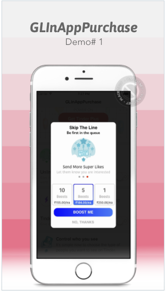
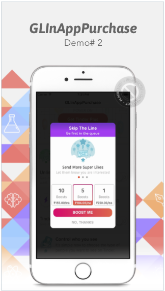
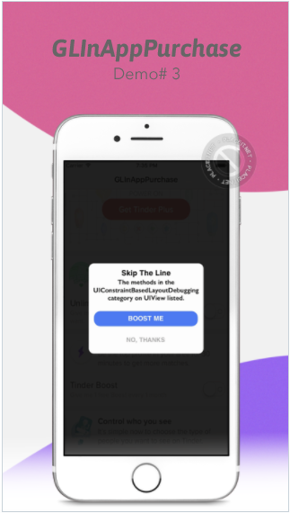

# GLInAppPurchase

[](https://travis-ci.org/gokulgovind/GLInAppPurchase)
[](http://cocoapods.org/pods/GLInAppPurchase)
[](http://cocoapods.org/pods/GLInAppPurchase)
[](http://cocoapods.org/pods/GLInAppPurchase)


 
 

**FYI:** Use tag0.1.2 for swift 2.2 

## Example

To run the example project, clone the repo, and run `pod install` from the Example directory first.Compatiable with ObjC,Swift 2 & Swift 3.0

## Requirements

## Installation

### CocoaPods

GLInAppPurchase is available through [CocoaPods](http://cocoapods.org). To install
it, simply add the following line to your Podfile:

### Manual
Copy the file `GLInAppPurchaseUI.swift` & `GLInAppPurchaseUI.xib` from ~/GLNotificationBar/GLNotificationBar/Classes to your project.


```ruby
pod "GLInAppPurchase"
```

## User Guide

### Swift:
```
let appBanner = GLInAppPurchaseUI(title: "Skip The Line", subTitle: "Be first in the queue", bannerBackGroundStyle: .TransparentStyle)

//Add image and Discription
appBanner.displayContent(imageSetWithDescription:
[
UIImage(named:"IMG_1")!:"Rewind Your Last Swipe##Go back and swipe again",
UIImage(named:"IMG_2")!:"",
UIImage(named:"IMG_3")!:"Send More Super Likes##Let them know you are interested",
])

//Add Button Action
appBanner.addAction(GLInAppAction(title: "10", subTitle: "Boosts", price: "₹155.00/ea", handler: { (actin) in
print("Completion handler called \(actin.actionSubTitle) Boost For \(actin.actionPrice)")
}))
appBanner.addAction(GLInAppAction(title: "5", subTitle: "Boosts", price: "₹184.00/ea", handler: { (action) in
print("Completion handler called \(action.actionSubTitle) Boost For \(action.actionPrice)")
}))

appBanner.addAction(GLInAppAction(title: "1", subTitle: "Boosts", price: "₹250.00/ea", handler: { (action) in
print("Completion handler called \(action.actionSubTitle) Boost For \(action.actionPrice)")
}))

//Button & Background Theme
appBanner.setBannerTheme([UIColor.whiteColor()], headerTextColor: UIColor.blackColor())
appBanner.setButtomTheme([UIColor.blueColor(),UIColor(netHex:0x2375F8)], buttonTextColor: UIColor.whiteColor())

//Set Okay and Cancel Button Title
appBanner.addButtonWith("BOOST ME", cancelTitle: "NO, THANKS") { (str) in
print(str)
if str == "NO, THANKS" {
}
appBanner.dismissBanner()
self.showSimpleAlert("\(str) Button Clicked")
}

appBanner.presentBanner()
```


## Author

gokulgovind, gokulece26@gmail.com

## License

GLInAppPurchase is available under the MIT license. See the LICENSE file for more info.
